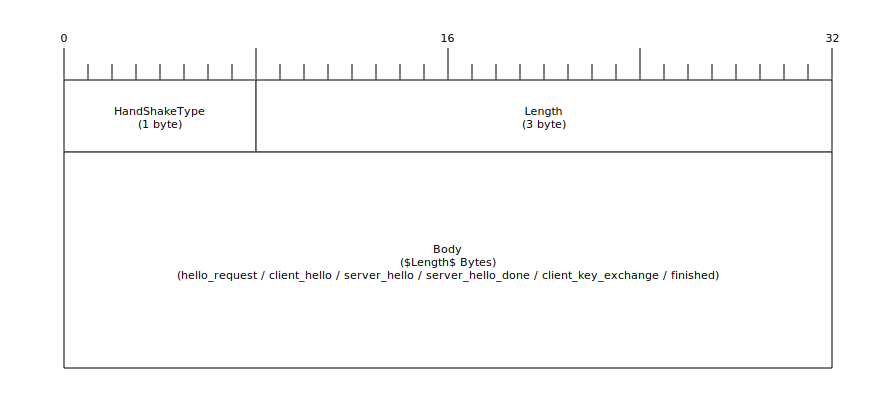
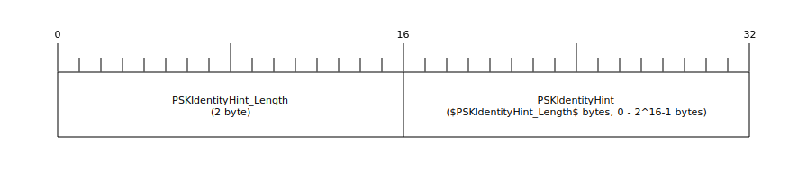
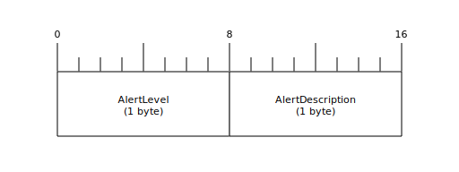

# Overview of the Pre Shared Key TLS 1.2 Frames
This is a visualization, simplification and partly explanation of the TLS 1.2 Standard defined in [RFC 5246](https://datatracker.ietf.org/doc/html/rfc5246) and [RFC 4279](https://datatracker.ietf.org/doc/html/rfc4279) \
It should help people implement, analyze and understand the TLS Framed on a bit and byte level. \
(C) [Martin Albert](https://albert-martin.de) 2025, [CC by 4.0](https://creativecommons.org/licenses/by/4.0/) (this includes Text, Pictures and Code)

---
[[toc]]

---

## Target Audience

Let's keep this short, this is aimed towards people, who want to know which bits and bytes are needed to get a Pre-Shared-Key TLS connections running. For an overview of what TLS is, you can take a look at the excellent explanation from Cloudflare: [What is TLS?](https://www.cloudflare.com/learning/ssl/transport-layer-security-tls/) \
I will not go in deep on how to get keys into systems. I will assume that, that already happened in a secure manner. \
TLS 1.3 will be mentioned multiple times, but it is different in many key aspects and therefore the 1.2 Knowledge will help you understand it, but further research is definitely required, when working with TLS 1.3.

## Basics

* TLS 1.2 is specified in the [RFC 5246](https://www.rfc-editor.org/rfc/rfc5246). A lot of ciphers, extensions and alerts are defined in additional RFCs.
* TLS lives in the TCP Payload and application data will live inside of TLS messages
* TLS is not 1 to 1 mappable into UDP. Rather, a new standard is needed. (e.g. dTLS)
* TLS is stateful. Messages and their frame structure can depend on the previous TLS message.
* Whether a connection requires TLS is determined implicitly. A common systematic is to have TLS connection and plaintext connections separated by different TCP ports. (E.g. http uses 80, while https (http secured by TLS) is on port 443)
* Each participating needs to either take the role of the server or the client in the communication.
* The client is always responsible for starting the TLS Handshake. Announcing a TLS Server availability or requesting the client to connect to the server require other technologies/techniques not defined in (d)TLS.
* Most parameters and their hex representation can be found on [IANA](https://www.iana.org/assignments/tls-parameters/tls-parameters.xhtml)
---

## TCP
The TLS Frames live here inside the payload. More precisely, multiple TLS Record Frames can be (and are commonly) found in one payload. 

## TLS Record Layer

**Content Type:** \
The Content Type determines which data can be found inside the Fragment and how it should be interpreted.
| Value       | Name                    | Description |
|-------------|-------------------------|-------------|
| 22  (0x16)  | handshake               | The initial handshake consists mainly out of these kinds of messages. There are multiple kinds of handshake messages and each will have their own special frame inside the handshake frame. |
| 20  (0x14)  | change_cipher_spec      | The change cipher spec messages will be also part of the handshake but doesn't count to the handshake messages. There are no further frames inside the change cipher spec frame. |
| 23  (0x17)  | application_data        | The encrypted[^1] date will be sent inside this frame. There will be no further frames inside application data frame. |
| 21  (0x15)  | alert                   | Alerts are a tool to signal states and errors to the other communication partner. Alerts are not stateful and can therefore be sent at any time required. |

**Major/Minor Version:** \
Determines the version used for the current TLS Record Frame. You can not determine the actual TLS Version used in the Communication from that. The actual TLS version will be negotiated in the handshake-frames/-messages. \
In the TLS Record Frame, you should accept any version, where the major version is 3. This is mainly because there are a lot of wrong implementation for servers out there, which will close the connection on seeing a newer version, without even trying to negotiate the version number in the handshake. Therefore, a lot of clients send TLS 1.0 {3,1} messages out to prevent this happening. \
Be aware that TLS Version 1.3 uses the version numbers of 1.2 and indicates the possibility of an upgrade via an extension.
| Major        | Minor     | Version     |
|--------------|-----------|-------------|
| 3  (0x03)    | 4  (0x04) | TLS 1.3     |
| 3  (0x03)    | 3  (0x03) | TLS 1.2     |
| 3  (0x03)    | 2  (0x02) | TLS 1.1     |
| 3  (0x03)    | 1  (0x01) | TLS 1.0     |
| 3  (0x03)    | 0  (0x00) | SSL 3.0     |
|--------------|--UDP/DTLS--|-------------|
| 254(0xfe)    | 253(0xfd) | DTLS 1.2    |
| 254(0xfe)    | 255(0xff) | DTLS 1.0    |

**Length:** \
The amount of bytes in the upcoming fragment.\
Length <= 2^14

**Fragment:** \
The Fragment itself can have multiple types and depend on the last negotiated cipher suite. The initial state is always Plaintext, where all data inside the fragments are plain to read and write and only consist of the data and no other fields. 
The Fragment type will change once "Change Cipher Spec"-Messages gets sent out. Then the type will most likely either change to a "GenericBlockCipher"-type or a "GenericAEADCipher"-Type. The chosen type depends on the negotiated cipher suite in the Handshake.

For example, when the Cipher AES with CBC is used the Fragment type will change to a GenericBlockCipher, while AES with GCM will produce a GenericAEADCipher type. 

The exact composition of non-Plaintext fragment always depend on their type and used cipher. 
For Example an GenericAEADCipher for an AES_256_GCM will consist of an 8 byte nonce (defined in the TLS [RFC 5246](https://www.rfc-editor.org/rfc/rfc5246)), the encrypted content (size equals to data size rounded up to a multiple of the blocksize of the cipher(in this case rounded up to a multiple of 32 bytes)) and an Authentication Tag (size is defined in the RFC of the used cipher, in the case of AES_256_GCM [RFC5116](https://datatracker.ietf.org/doc/html/rfc5116) and therefore 16 bytes)

## 01 - TLS Handshake
TLS Handshake Frame

**HandShakeType:** \
Determines which data can be found inside the body and how it should be interpreted.
| Value         | Type                |
|---------------|---------------------|
| 0  (0x00)     | hello_request       |
| 1  (0x01)     | client_hello        |
| 2  (0x02)     | server_hello        |
| 11 (0x0B)     | certificate         |
| 12 (0x0C)     | server_key_exchange |
| 13 (0x0D)     | certificate_request |
| 14 (0x0E)     | server_hello_done   |
| 15 (0x0F)     | certificate_verify  |
| 16 (0x10)     | client_key_exchange |
| 20 (0x14)     | finished            |

**Length:** \
The amount of bytes in the upcoming body.\
Because of the limitation of the frame record, the length will always be <= 2^14 - 4, even though 3 bytes for the length are being used.

## 01.00 - TLS Handshake hello_request

The Hello Request Frame is empty. If the Handshake type of the Handshake Frame is 0 (0x00) the body will be empty and the Handshake Frame Length Parameter will be zero.

**Hello Request Usage Explanation:** \
Hello Requests are meant to allow the server to suggest the client to renegotiate TLS. It's not meant for the server to request an initial client hello.\
The client can accept it and simply start with a client hello, but can also decline (a no_renegotiation alert upon declining is optional).

## 01.01 - TLS Handshake client_hello

**Version:** \
Offer the clients highest supported version, up to TLS 1.2. For Version 1.3 you have to set this field to 1.2 and offer all available versions in the "supported_versions" extension. If the supported_versions extension is not provided, then this field counts as an offer to the server allowing him to choose any version <= the version you provided.
| Major        | Minor     | Version     |
|--------------|-----------|-------------|
| 3  (0x03)    | 4  (0x04) | TLS 1.3     |
| 3  (0x03)    | 3  (0x03) | TLS 1.2     |
| 3  (0x03)    | 2  (0x02) | TLS 1.1     |
| 3  (0x03)    | 1  (0x01) | TLS 1.0     |
| 3  (0x03)    | 0  (0x00) | SSL 3.0     |
|--------------|--UDP/DTLS--|-------------|
| 254(0xfe)    | 253(0xfd) | DTLS 1.2    |
| 254(0xfe)    | 255(0xff) | DTLS 1.0    |

**Random:** \
4 bytes for a UNIX timestamp + 28 random bytes

**SessionID:** \
Used for Session Renegotiation / Resumption. Always 0 if no previous TLS Session exists (initial state) or if no resumption is needed. 

**Ciphersuites/Compressions:** \
A list of all supported ciphers and compression methods offered by the client.
[IANA Summary of all cipher suites](https://www.iana.org/assignments/tls-parameters/tls-parameters.xhtml#tls-parameters-4)
Compression methods are very uncommon and are by default disabled in most browsers or OpenSSL. TLS 1.3 removed this feature entirely. You will find a list of 0x00 (= no compression) pretty much everywhere. 

**Extenstions:** \
A list of all supported and offered Extensions. Can be fully omitted and is then equal to an empty list of extensions. Whether or not the Extensions fields can be omitted, can be calculated by taking the Handshake Frame's length and subtracting the length of all above fields.

The format of each extension consists of 1 byte Length_Field and 1 byte for the extension type. Following up to that, optional data can be provided and the size of the data is determined by the Length_field. A list of all Extension types can be found on the [IANA website](https://www.iana.org/assignments/tls-extensiontype-values/tls-extensiontype-values.xhtml)

Extensions are used for a variate of reasons. Some supply the TLS implementation with necessary information (e.g. servername extension provides the hostname of the used URL for the connection, allowing the implementation to check the certificates for the servername, in the case of PKI TLS), while other extension types provide data (e.g. supported version extension supplies a list of acceptable TLS versions) or other extension types can change algorithm usage (e.g. the extension encrypt_then_mac indicates that mac should be created using the encrypted data rather than normally the plaintext data).

There are too many extensions that are too complicated to be described here in this document. They can be quite the burden, as the initial Implementation of an TLS Handshake is rather simple in comparison to what is needed if you would try to implement ALL extensions. Therefore, if it is necessary, the RFCs for each extension need to be examined for the implementation of each Extension.

## 01.02 - TLS Handshake server_hello

**Versions:** \
The Server chooses the version here. What is written in this field is the final used TLS Version (<= client_hello.version and only if the supported version extension is not used). 

**Random:** \
4 bytes for a UNIX timestamp + 28 random bytes

**SessionID:** \
Provides the current Session with a random number as an id. If the handshake was successful, the client can use this SessionID in a new handshake in his SessionID field and if the server accepts it by also reusing the same SessionID in its server_hello, all parameters and keys of this session will be reused for the new Session. By choosing a different SessionID, the server can decline the request for session resumption. The Server can also omit a sessionID, indicating that Session Resumption is not allowed at all.

**Cipherseute/Compression:** \
Shows the server chosen and accepted cipher suite and compression method.
Not a list anymore, only single entries for cipher suits and compression method.

**Extenstions:** \
Shows all accepted Extensions.
Still a list. Can be fully omitted, just like in the client_hello.

## 01.03 - TLS Handshake server_key_exchange

The format of this message depends on the chosen Cipher. 

In Pre Shared Key Case, it will always look like here described. 

**PKDIdentityHint:** \
The used PKDIdentityHint should be used to determine which Pre Shared Key should be used.

This frame is identical to the client_key_exchange frame, except that this message can be optional while the client one is a must.

## 01.04 - TLS Handshake server_hello_finished

Indicates that the Server is finished with sending all initial messages. This is necessary in the PKI TLS case as otherwise it is not possible to know whether the server will or will not send a Certificate and therefore the client would be deadlocked in this scenario. In the PSK TLS case it needs to be sent to ensure that the client doesn't deadlock waiting for a server_key_exchange message, that will never be sent.

## 01.05 - TLS Handshake client_key_exchange

Pretty much identical to the server_key_exchange frame, except that it is mandatory and the fields are called PSKIdentity instead of PSKIdendityHint

## 01.06 - TLS Handshake finished

The Finished messages are sent by both client and server after negotiating all necessary information. The Handshake should only happen after a change_cipher_spec message and therefore be always encrypted by the negotiated cipher and keys. The verify data of each of the finished messages are pretty much proof that each side saw and used the same negotiated parameters. Both send their verify data out, and both sides verify that they saw and used the same negotiated data:

**VerifyData:** \
VerifyData = PseudeoRandomFunction(master_secret, finished_label, Hash(handshake_messages))

Length and PRF(PseudeoRandomFunction) are actually determined by the used cipher suite, but currently all cipher suites in use, require 12 bytes and SHA256 as PRF. Leading to the following formula being the standard as of the current data for all ciphers:

VerifyData =  SHA256(master_secret, “client finished” + SHA256(handshake_messages))

VerifyData =  SHA256(master_secret, “server finished” + SHA256(handshake_messages))

handshake_messages = All of the data from all messages in this handshake (not including any HelloRequest messages) up to, but not including, this message. This is only data visible at the handshake layer and does not include record layer headers. This is the concatenation of all the Handshake structures. In the case of the client finished message, this includes Client_Hello, Server_Hello, Server_key_Exchange, Server_hello_done and Client_key_exchange. In the case of the server, this includes the same plus the client's finished message.

## 02 - TLS change_cipher_spec

A TLS Message with this type will always indicate that all following messages will be encrypted and the fragment type of the TLS Record Layer will from now on change for the sender of the change_cipher_spec message.

The message consists of only 1 byte, and there is only one type (0x1) defined.

## 03 - TLS application_data

The frame is straight forward and consists only of the payload. This should only be sent out encrypted using the right fragment type.  

## 04 - TLS alert

Alerts indicate an event happened (most of the types indicate errors).

**AlertLevel:** \
Either Warning (0x1) or Fatal (0x2). After a Fatal alert the communication needs to be cut. No resumption is possible after that.
**AlertDescription:** \
The Type of Alert. 

A full list of all alerts can be found on [IANA](https://www.iana.org/assignments/tls-parameters/tls-parameters.xhtml#tls-parameters-6), but a short list of common alerts can be found here:

| Value         | Type                        |
|---------------|-----------------------------|
| 0  (0x0)      | close_notify                |
| 10 (0xa)      | unexpected_message          |
| 20 (0x14)     | bad_record_mac              |
| 40 (0x28)     | handshake_failure           |
| 47 (0x2f)     | illegal_parameter           |
| 50 (0x32)     | decode_error                |
| 51 (0x33)     | decrypt_error               |
| 70 (0x46)     | protocol_version            |
| 80 (0x50)     | internal_error              |
| 100(0x64)     | no_renegotiation            |
| 110(0x6e)     | unsupported_extension       |
| 115(0x73)     | unknown_psk_identity        |

Most commonly will be the close_notify-alert, which is no error by itself. It indicates that the side sending this out wants to close down the connection. When using a fatal type, the connection should be closed down immediately by both sides, and all data after this message should be discarded. If a warning close_notify alert is being sent out, the other partner can still send data. 

In the Standard RFC, the fatal close_notify alerts should always be confirmed by the other side by also sending out a fatal close_notify alert, and only then should the TCP connection be closed down by both sides. This is one of the rules that is more on paper than practically done. Many implementations and big companies actually close down their TCP connection right after the server sends out the fatal Close_Notify alert. 

[^1]: Even though the word encryption is used, in the context of this document (as long as it is not stated otherwise), it will mean both encrypted or mac/certificate authenticated payload.